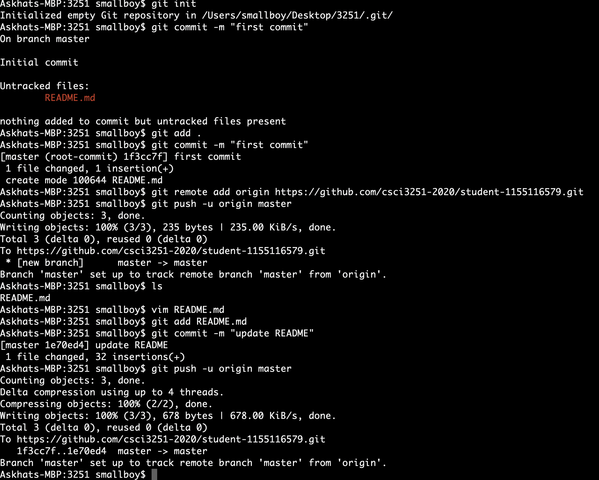

# student-1155116579
## Introduction
Hello everyone! 

My name is Askhat

## Developer stuff
Not so experienced in programming, took some major courses.

Highly recommend to take **CSCI4430** (you will learn *a lot*).

## Programming language:
Rank | Language | Comments
--- | --- | ---
1 | `C/C++` | The primary language I use.
2 | `Python`| Use for scripts.
3 | `JavaScript` | Learning to submit 3100 project :D
4 | `Java` | Took 1130 course, nice to learn OOP.

## Extra information

Insterested in:
* sleeping 
* eating

Things I want to accomplish:
- [x] Finish this milestone
- [ ] Graduate

## ScreenShot

